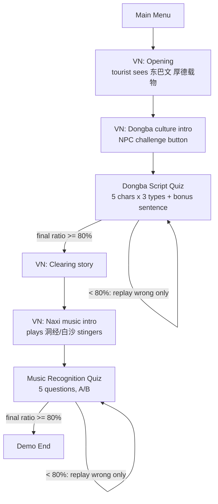

# Naxi Culture Demo — Build Plan

Builds the game described in `游戏效果概述` inside the empty `naxi-game` Godot 4.6 project. We reuse the Dialogic framework + VN art/audio from the sibling `naxi-ancient-music`, drive the whole demo with one flow director, and make both quizzes fully data-driven so real assets/text drop in later with zero code changes.

## 1.0 scope

This is the 1.0 version. Explicitly OUT of scope (deferred to the "更新版"): the drag-and-drop 拼装挑战, the modern-context "梗" sentence-meaning options, and the music-emotion blind-guess. 1.0 has exactly 5 unified question types: 4 Dongba types + 1 music type, all sharing one schema. Failed quizzes replay only the wrong questions (full-module restart is deferred).

## Target flow (from the doc)




## Architecture

A single flow director owns an ordered step list; each step is either a Dialogic timeline (hosted in a VN stage scene) or a minigame scene. Steps report completion by calling `GameManager.advance()`, which loads the next step. There is no per-minigame signal.

- Autoloads (in [project.godot](E:/mcp/projects/NaxiMusic/naxi-game/project.godot)):
  - `Dialogic` (from copied addon)
  - `GameManager` ([Core/GameManager.gd](E:/mcp/projects/NaxiMusic/naxi-game/Core/GameManager.gd)) — flow state machine + quiz sessions; holds the ordered step list, `advance()`, and the wrong-question retry tracker (see Retry logic).
  - `SceneLoader` ([Core/SceneLoader.gd](E:/mcp/projects/NaxiMusic/naxi-game/Core/SceneLoader.gd)) — deferred scene swaps + fade transition.
  - `ContentDB` (new `Core/ContentDB.gd`) — loads `res://Data/content.json`, resolves asset paths, falls back to placeholders when a file is missing.
- Bootstrap: [Core/Game.tscn](E:/mcp/projects/NaxiMusic/naxi-game/Core/Game.tscn) becomes the launcher that shows MainMenu, then hands control to `GameManager`.

## Unified minigame trigger

No dedicated `start_quiz` signal. Since `GameManager` owns the flow list, VN steps just end: on Dialogic `timeline_ended`, `VNStage` calls `GameManager.advance()` and the director loads whatever the next step is. For a mid-timeline trigger, timelines emit a single generic `[signal arg="advance"]` that `VNStage` also maps to `advance()`. Adding a new minigame = add a step + a scene; no changes to timelines or `VNStage`.

## Content = data, not code (unified schema)

All Chinese text, answer keys, options, and asset paths live in `res://Data/content.json`. One `Question` shape covers all 5 types: both the 题干 (`prompt`) and every `option` use the same nullable `{text, image, audio}` triple, so text-options and image-options are structurally identical, and the "播放键" sits wherever `audio` is present (prompt for types 1/4, per-option for type 3). Quiz scenes render generically from this. Missing assets auto-fall back: glyphs → labeled box, audio → `Assets/_placeholder/silent.ogg`, music clips → colored panel + silent stream.

Container:

```json
{
  "version": "1.0",
  "quizzes": {
    "dongba": { "title": "东巴文字挑战", "pass_ratio": 0.8, "questions": [] },
    "music":  { "title": "纳西古乐辨识", "pass_ratio": 0.8, "questions": [] }
  }
}
```

`Question` fields:

- `id` (string, unique/stable) — used by the retry tracker.
- `type` (enum) — layout hint: `image_to_text` (类型1), `audio_to_image` (类型2), `text_to_image` (类型3), `sentence_to_text` (类型4), `music_to_text` (音乐).
- `instruction` (string, nullable) — question line, e.g. "这个文字代表什么？".
- `prompt` `{ text, image, audio }` — all nullable; `audio` is the 题干 play键 and a `.ogv` path is played as video (loader dispatches by extension), covering the music clip.
- `options[]` — each `{ text, image, audio }`, all nullable; `text` OR `image` is the choice, `audio` is the optional per-option play键 (类型3).
- `answer_index` (int) — index into `options`.
- `explanation` (string, nullable) — shown on a wrong answer.

Example (类型1; the other 4 follow the same shape):

```json
{
  "id": "dongba_t1_sun", "type": "image_to_text",
  "instruction": "这个文字代表什么？",
  "prompt": { "text": null, "image": "res://Assets/dongba/glyphs/dongba_05_sun.png", "audio": "res://Assets/dongba/audio/dongba_05_sun.ogg" },
  "options": [
    { "text": "山", "image": null, "audio": null },
    { "text": "水", "image": null, "audio": null },
    { "text": "太阳", "image": null, "audio": null },
    { "text": "火", "image": null, "audio": null }
  ],
  "answer_index": 2,
  "explanation": "这是‘日 / 太阳’的东巴文写法。"
}
```

## Retry logic (replay wrong-only)

`GameManager` runs a quiz session: `{ questions[], result[id] ∈ {CORRECT, WRONG}, queue[] }`.

- Round 1: `queue` = all questions; on answer set `result[id] = (chosen == answer_index)` and play sfx + explanation.
- End of round: `ratio = count(CORRECT)/total`. If `ratio ≥ pass_ratio` → `advance()`. Else `queue = [ids where WRONG]`, show ResultScreen ("答对 X/Y，正确率 Z%") with two buttons: "重做错题" (replay only the wrong ones) and "放弃返回菜单" (escape hatch → `GameManager` resets the session and returns to MainMenu). A question's status is its most recent attempt, so re-answering correctly flips it to CORRECT and raises the final ratio. Loop until pass or the player escapes. (Full-module restart is deferred.)

## Asset paths & naming (drop-in convention)

```
Assets/
  dongba/glyphs/    dongba_{NN}_{slug}.png      (01 人,02 山,03 水,04 火,05 日)
  dongba/audio/     dongba_{NN}_{slug}.ogg
  dongba/sentence/  dongba_sentence_01.png / .ogg
  music/dongjing/   dongjing_{NN}.ogv           (洞经音乐 = correct answer A)
  music/baisha/     baisha_{NN}.ogv             (白沙细乐 = correct answer B)
  music/stingers/   stinger_fail_dongjing.ogg / stinger_win_baisha.ogg
  sfx/              sfx_correct.ogg / sfx_wrong.ogg / sfx_click.ogg
  vn/backgrounds/   bg_{slug}.png
  vn/portraits/     char_{name}_{emotion}.png
  _placeholder/     silent.ogg + placeholder textures
```

Rules: lowercase, `_`-separated, 2-digit index, `.png`/`.ogg`/`.ogv`. Chinese lives in JSON only.

## Reuse from naxi-ancient-music

Copy into `naxi-game`: `addons/dialogic/` (2.0-Alpha-19), the VN chatbox style `Assets/chatbox style/New_File.tres`, usable backgrounds (Lijiang home / living room), tourist + host portraits, and any usable sfx. Rename copied files into the convention above. We do NOT reuse its ghost/puzzle timelines or plot (different story).

## Dongba quiz design

- One reusable `QuizCard` component renders any question purely from its `prompt` + `options` fields (no per-type code paths), covering types 1–4. 5 chars × 3 types + 1 bonus sentence question.
- Correct → correct sfx + encouragement; wrong → wrong sfx + `explanation`. Pass = final ratio ≥ 80% via the wrong-only retry loop above.

## Music quiz design

- Same `QuizCard` component, `music_to_text` type: prompt is a clip (`VideoStreamPlayer` when the `audio` path ends in `.ogv`, else `AudioStreamPlayer`), options are the two fixed text choices 洞经音乐 / 白沙细乐. 5 questions. Pass = final ratio ≥ 80% via the same retry loop.

## Screens

MainMenu, VNStage (hosts Dialogic; on `timeline_ended` or a generic `advance` signal calls `GameManager.advance()`), DongbaQuiz, MusicQuiz (both host `QuizCard`), ResultScreen (score + pass/fail + "重做错题" + "放弃返回菜单" escape hatch), EndScreen.